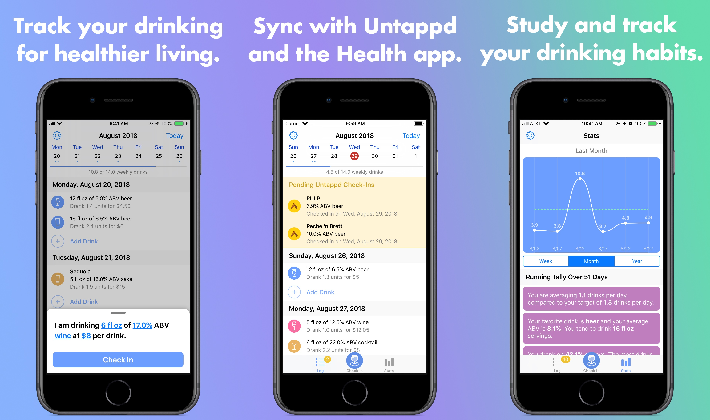

Good Spirits is a drink tracking iOS app that helps you stay under the government limits for "low-risk" drinking. Includes charts and stats, the ability to pull your check-ins from Untappd, and the ability to sync your drinks as calories to HealthKit.

You can find the App Store version [here][app]. Unfortunately, HealthKit is not available in this release. You can always compile the app yourself to get this functionality.

# Technical Details

Compiling the code should be pretty straight-forward. Just be sure to run `git submodule update --init --recursive` after cloning the repo.

Note that there are three unique build configurations in this project, designed to toggle donation and HealthKit functionality. You can change this in your Scheme settings.

The directory structure is a bit messy. `External` contains modified dependencies. `Submodules` contains unmodified (git-submodule) dependencies. `Modules` contains the independent data layer, compilable as its own project. `GoodSpirits` contains the actual project code.

Sometimes, the compiler will complain about a "cycle in dependencies between targets 'Good Spirits' and 'GRDBiOS'". A clean build will fix this.

My Untappd Client ID, which is necessary for Untappd API calls, is not included. (I'm not sure I should be publishing it.) If you have API access, you can create a Keys.plist file in the `GoodSpirits` directory, add it to the Good Spirits target in Xcode, and add your Client ID string to the plist with an `untappd` key.

# Licensing

The source code is available under the GPL license with absolutely no support or maintenance commitments. Note that GPL-licensed code isn't compatible with the App Store. If you're interested in releasing a fork in the App Store, please contact me.

You can find licenses for the third-party assets in the Licenses.txt file.

The app icon is **not** licensed for public use! You may not use the name of the app ("Good Spirits") nor the app icon in any of your own projects.

[app]: https://itunes.apple.com/us/app/good-spirits/id1434237439?mt=8&ref=github